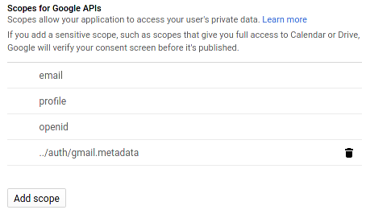

= prometheus-gmail-exporter

Checks gmail labels for unread messages and exposes the counts via prometheus.

= Example prometheus Metrics

----
# HELP Label_33_total Triage Total
# TYPE Label_33_total gauge
Label_33_total 159.0
# HELP Label_33_unread Triage Unread
# TYPE Label_33_unread gauge
Label_33_unread 0.0
# HELP INBOX_total INBOX Total
# TYPE INBOX_total gauge
INBOX_total 44348.0
# HELP INBOX_unread INBOX Unread
# TYPE INBOX_unread gauge
INBOX_unread 39.0
----

= Setup and installation

== Python3 dependencies

* configargparse
* oauth2client
* googleapi

== Getting `client_secrets.json`

* Go to the Google Developers API Console: https://console.developers.google.com/apis/credentials
* Create Credentials -> OAuth Client ID 
** Application Type: Other
* Click the "down arrow" icon to download your credentials file - `client_secret___.json`.
* Create a OAuth 2 Consent screen with whatever name and icon you like. The scopes needed are; 

== Running

Simply;

----
./gmail-prometheus.py
----

Options can be found with `--help`. 
