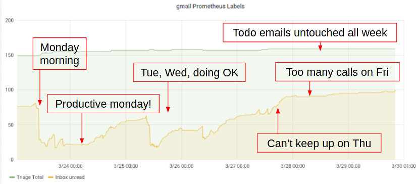
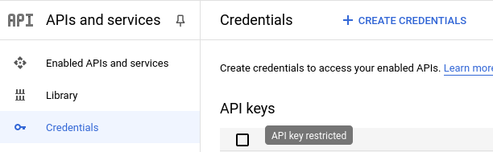
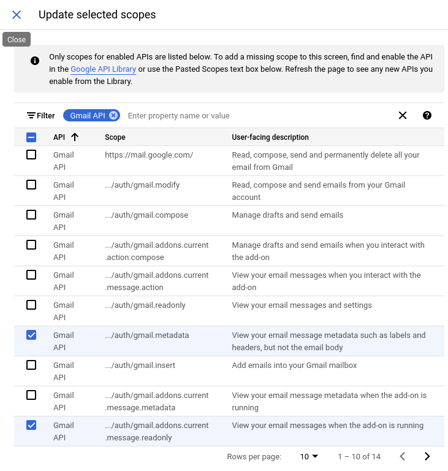

<div align = "center">
  <h1>prometheus-gmail-exporter</h1>

  Checks Gmail labels for unread messages and exposes the counts as Prometheus metrics.

[](#none)
[](https://goreportcard.com/report/github.com/jamesread/prometheus-gmail-exporter)
[](https://opensource.org/licenses/Apache-2.0)

</div>

This project is implemented in **Go**. The exporter serves Prometheus metrics, OAuth login, and a Kubernetes readiness endpoint on port `8080` by default.

There is a blog [article about why this was created, with an example integration to Grafana](https://medium.com/james-reads-public-cloud-technology-blog/watching-gmail-labels-with-prometheus-grafana-87b6745acd48). It looks like this;



## Example prometheus Metrics

```sh
# HELP gmail_label_total Total threads for a Gmail label
# TYPE gmail_label_total gauge
gmail_label_total{id="INBOX",name="INBOX"} 44351
# HELP gmail_label_unread Unread threads for a Gmail label
# TYPE gmail_label_unread gauge
gmail_label_unread{id="INBOX",name="INBOX"} 43
# HELP gmail_label_total Total threads for a Gmail label
# TYPE gmail_label_total gauge
gmail_label_total{id="Label_33",name=">/0. Triage"} 159
# HELP gmail_label_unread Unread threads for a Gmail label
# TYPE gmail_label_unread gauge
gmail_label_unread{id="Label_33",name=">/0. Triage"} 0
# HELP gmail_custom_query Result size estimate for a configured Gmail search query
# TYPE gmail_custom_query gauge
gmail_custom_query{name="fooquery"} 201
# HELP gmail_scrape_success 1 if the last metrics update succeeded for all labels and queries, else 0
# TYPE gmail_scrape_success gauge
gmail_scrape_success 1
```

On API failures, outdated label/query series are removed from `/metrics` and `gmail_scrape_success` is set to `0` so alerts can detect a bad scrape.

## Example configuration file (`prometheus-gmail-exporter.yaml`)

```yaml
labels:
  - Label_33

customQueries:
  - name: fooquery
    query: "important in:inbox"
```

Configuration files are read from, in order:

- `~/.prometheus-gmail-exporter/prometheus-gmail-exporter.cfg`
- `~/.prometheus-gmail-exporter/prometheus-gmail-exporter.yaml`
- `/etc/prometheus-gmail-exporter.cfg`
- `/etc/prometheus-gmail-exporter.yaml`

CLI flags override file settings. Run with `--help` for the full list.

## Setup API access

To allow this app to access your gmail, it needs a `client_secret.json` file, and a `login_cookie.dat`. The instructions below explain how to set this up.

### Getting `client_secret.json`

**NOTE**: Google frequently changes it's API, Web interface, and similar without much notice. These instructions were last tested and validated on 2024-04-14 - if the instructions or screenshots don't match what you're seeing, it would be really helpful if you could raise a GitHub issue on this repository and report it. Thanks!

* Go to the Google Developers API Console: https://console.developers.google.com/apis/credentials
* In the sidebar, select **Credentials**. 
* On the **Credentials** page, click the **Create Credentials** button in the toolbar.


 
* From the **Create Credentials** dropdown menu, select **OAuth Client ID**.
  * **Application Type:** _Desktop App_ (previously labeled _Other_, do not choose _Web application_).
  * **Name:** prometheus-gmail-exporter (or a name that you prefer)
  * Finally, click the blue **Create** button.
* On the **OAuth client created** popup window;
  * Take a copy of your **Client ID** and save it in a "secure text file" somewhere!
  * Click the "Download JSON" link to get your client_secrets file, named something like - `client_secret_1234.apps.googleusercontent.com__.json`.

### Create a OAuth 2 Content screen

* In the sidebar, select **OAuth 2 consent screen**
* Create a OAuth 2 Consent screen with whatever name and icon you like. The scopes needed are;



* Once the scopes have been selected, you should see a screen that looks like this;


### Next steps

* Rename your downloaded `client_secret_____.json` to just `client_secret.json`
  and put it in the directory; `~/.prometheus-gmail-exporter/`.

**NOTE**: To use this on [Google Accounts with Advanced Protection](https://landing.google.com/advancedprotection/), you cannot use [an _OAuth consent screen_ that is only in _Publishing status = Testing_,](https://support.google.com/cloud/answer/10311615) but must _Publish the App_ and [then have it verified](https://support.google.com/cloud/answer/9110914).

### Getting `login_cookie.dat`

The `~/.prometheus-gmail-exporter/client_secret.json` file which you download from Google only identifies (your own instance of) this app to talk to the GMail API.

The `~/.prometheus-gmail-exporter/login_cookie.dat` secret file identifies YOU, and gives access to your Gmail account via Google's API. This file cannot be directly downloaded from the Google Cloud Console, but is created by this tool on its first run, via an OAuth-based flow. Visit `http://localhost:8080/` and click **Login**. If this fails (e.g. due to an _"Error 400: redirect_uri_mismatch"),_ add `http://localhost:8080/oauth2callback` as an _Authorized redirect URI_ on the _OAuth 2.0 Client ID_ to complete the authentication flow.

To run this tool on a headless server, you may want to first create the `login_cookie.dat` on a Desktop/Workstation where a web browser is available, and then move it to the headless server, perhaps by mounting this file from some form of secret provider into the container. (See also [issue #9](https://github.com/jamesread/prometheus-gmail-exporter/issues/9) for more background.)

## HTTP endpoints

| Path | Purpose |
|---|---|
| `/metrics` | Prometheus metrics |
| `/` | Status page and OAuth login link |
| `/oauth2callback` | OAuth redirect handler |
| `/readyz` | Kubernetes readiness probe (ready once the HTTP server is up; does not require OAuth credentials) |

## Troubleshooting: `accessNotConfigured`

The GMail API is probably not enabled in your account yet. You can enable it by following instructions here; https://developers.google.com/workspace/guides/enable-apis . 

## Run as a container image

There is a published container in **ghcr.io**, called `ghcr.io/jamesread/prometheus-gmail-exporter:latest`.

Using either `docker` or `podman` will be fine. I like `podman` better, so
examples are with podman.

```
podman run -v ~/.prometheus-gmail-exporter/:/root/.prometheus-gmail-exporter/ ghcr.io/jamesread/prometheus-gmail-exporter:latest
```

## Build your own container image

```
podman build . -t gmail-exporter
podman run -v ~/.prometheus-gmail-exporter/:/root/.prometheus-gmail-exporter/ gmail-exporter --labels Label_33
```

## Running via command line

### Option A) Go toolchain

```
go build -o prometheus-gmail-exporter ./cmd/prometheus-gmail-exporter/
./prometheus-gmail-exporter --labels Label_33 INBOX -d
```

### Option B) Makefile

```
make
./prometheus-gmail-exporter --labels Label_33 INBOX -d
```

Options can be found with `--help`.

## Development

```
make test
make lint
```

## Releases

Pushes to `master` run tests and [semantic-release](https://semantic-release.gitbook.io/) (via `@semantic-release/github`). Use [Conventional Commits](https://www.conventionalcommits.org/) (`feat:`, `fix:`, etc.) so the next version, GitHub release, container image, and binary are produced automatically when there are releasable changes. Closing keywords in commits or PR descriptions (`fixes #123`) trigger success comments on linked issues and pull requests.
